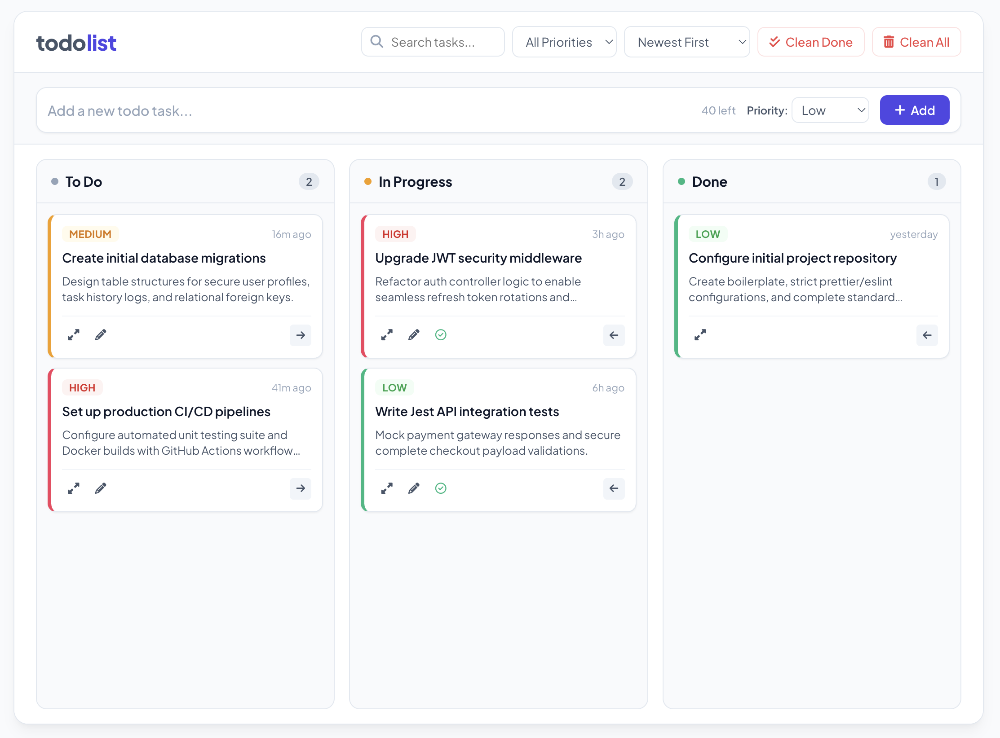

# Daily Task Tracker

A **minimalist**, **responsive**, and **feature-rich** Daily Task Tracker web application built with **HTML**, **CSS**, and **Vanilla JavaScript**.

### 🌟 Star this Repository!

Hi there! We're thrilled that you stopped by to check out our project. This repository is a labor of love, built with passion, creativity, and plenty of late-night coding sessions. We truly believe in what we're creating, and we hope you'll enjoy using it as much as we enjoyed building it.

If our project adds value to your day or if you’re simply a fan of cool, open-source software, please consider giving it a star ⭐. Your support inspires us to keep pushing forward!

---

## Table of Contents

- [Features](#features)
- [Project Structure](#project-structure)
- [Screenshot](#screenshot)
- [Installation](#installation)
- [Usage](#usage)
- [Browser Compatibility](#browser-compatibility)
- [Contributing](#contributing)
- [License](#license)
- [Contact](#contact)

## Features

- Three-Column Kanban Board: Tasks flow dynamically across To Do, In Progress, and Done stages.
- Intuitive Drag and Drop: Native HTML5 drag-and-drop functionality with responsive navigation arrow fallbacks for touch devices.
- Inline Task Creator: Collapsible, character-limited title and optional description inputs without distracting modal popups.
- Direct Priority Adjustments: Quick-toggle priority levels (Low, Medium, High) directly from task cards or via custom context menus.
- Smart Right-Click Context Menu: Fast, desktop-like mouse controls to view, edit, move, or delete tasks.
- Advanced Sorting and Filtering: Real-time search indexing, priority filters, and chronological sorting utilities.
- Local Persistence: Instant state preservation using local browser storage (localStorage) under the "daily-task-tracker" key.
- Dynamic Time Tracking: Tracks task creation and last-modified timestamps with relative "time ago" formatting.
- Run with Devin (optional): Kick off a [Devin](https://devin.ai) session from any To Do card. The task moves to In Progress, a global poll tracks the session, and the task auto-moves to Done when the session reaches a terminal state. The associated session is always one click away via "Open Devin session". Requires running the optional backend server (see below).

## Project Structure

The application is plain HTML, CSS, and Vanilla JavaScript with **no build step**. Markup, styles, and logic are split into separate files for readability:

```
.
├── index.html          # Page markup; links the stylesheet and scripts
├── css/
│   └── styles.css      # All styles (design tokens, layout, components, responsive)
└── js/
    ├── state.js        # App state, demo seed data, localStorage load/save
    ├── utils.js        # Date/time formatting helpers
    ├── toast.js        # Toast notifications
    ├── modals.js       # Modal open/close + async confirmation dialog
    ├── render.js       # Board render engine and task card DOM generation
    ├── tasks.js        # Add / move / edit / delete / complete task logic
    ├── menus.js        # Right-click context menu + priority badge dropdown
    ├── events.js       # Event listener wiring (inputs, filters, drag & drop)
    ├── devin.js        # Optional "Run with Devin" integration (modal + global poll)
    └── main.js         # Bootstrap on DOMContentLoaded
```

The optional Devin integration also adds a tiny zero-dependency backend:

```
├── server.js           # Node static server + Devin API proxy (keeps the key server-side)
└── package.json        # `npm start` runs server.js (Node >= 18)
```

Scripts are loaded as classic (non-module) scripts in dependency order, so the core app still runs by simply opening `index.html` directly in a browser — no server required. The Devin feature is the only part that needs the backend (so the API key never reaches the browser); without it, every other feature works unchanged.

## Screenshot

<p align="center">
  
</p>

## Installation

There are two methods to get this project up and running on your local machine.

### Prerequisites

- A modern web browser (Chrome, Edge, Firefox, Safari, etc.)
- Download [Git](https://git-scm.com/) *(optional, if you choose to clone the repository)*

### 1. Clone the Repository

If you have Git installed, you can clone the repository by following these steps:

1. Open your **terminal** or **command prompt**.

2. Run the following command:
   
    ```bash
    git clone <repository-url>
    ```

4. Navigate into the project directory:

    ```bash
    cd daily-task-tracker
    ```

### 2. Download as ZIP

If you prefer not to use Git, you can download the project as a ZIP file:

1. Go to the GitHub repository page in your web browser.
2. Click the green **"Code"** button at the top right of the repository's file list.
3. Select **"Download ZIP"** from the dropdown menu.
4. Once the ZIP file is downloaded, extract it to your desired location.

## Usage

This is a standard frontend project, so you can run it directly in your web browser without any complex setup or server configuration:

1. Open the project folder on your computer.
2. Locate the `index.html` file.
3. **Double-click** the `index.html` file to launch it in your default web browser.

*Alternative Method:* You can also drag and drop the `index.html` file directly into any open browser tab (Chrome, Firefox, Safari, Edge, etc.).

## Run with Devin (optional)

The "Run with Devin" button on To Do cards starts a real [Devin](https://devin.ai) session. Because the Devin API requires a secret key and cannot be called from a browser (CORS), this feature is served by a small backend that holds the key server-side and proxies requests — the key is never exposed to the client.

### Prerequisites

- [Node.js](https://nodejs.org) >= 18
- A Devin API key (create one at https://app.devin.ai/settings/api-keys)
- Your Devin organization ID (`org-...`) and the email of the org member that sessions should be attributed to

Sessions are **only** created when the server is explicitly told which org and user to create them for. If either the org ID or the user email is missing, the "Run with Devin" button is hidden entirely and the API returns `503`.

### Start the server

```bash
cd finished
DEVIN_API_KEY=your_key_here \
DEVIN_ORG_ID=org-your_org_id \
DEVIN_USER_EMAIL=you@yourcompany.com \
npm start
```

Then open http://localhost:3000. The server serves the static app and exposes:

- `GET  /api/devin/config` — whether Devin is configured (`{ enabled }`); the frontend uses this to show/hide the Devin UI
- `POST /api/devin/sessions` — create a session (`{ prompt, title }`), attributed to `DEVIN_USER_EMAIL` via `create_as_user_id`
- `GET  /api/devin/sessions/:id` — fetch a session's status

### How it works

1. Click the robot icon on a **To Do** card and describe what Devin should do.
2. On confirm, a session is created and the task moves to **In Progress** with a status pill.
3. A single global poll watches every task that has a session and moves it to **Done** once the session reaches a terminal status (`exit`, `error`, or `suspended`).
4. **Open Devin session** is always available on any card with a session.

If you open `index.html` without the server, the board still works fully — the Devin calls simply no-op.

## Browser Compatibility

Tested and working on:
- Chrome (latest)
- Firefox (latest)
- Safari (latest)
- Edge (latest)
- Mobile browsers (iOS Safari, Android Chrome)

## Contributing

Contributions are welcome! Please feel free to submit a pull request or open an issue for any enhancements or bug fixes.

## License

This project is licensed under the MIT License. See the [LICENSE](LICENSE) file for more details.

## Contact

Whether you need to report an issue, propose a new feature, require setup and integration guidance, or submit a security disclosure, please open an issue on the repository.
